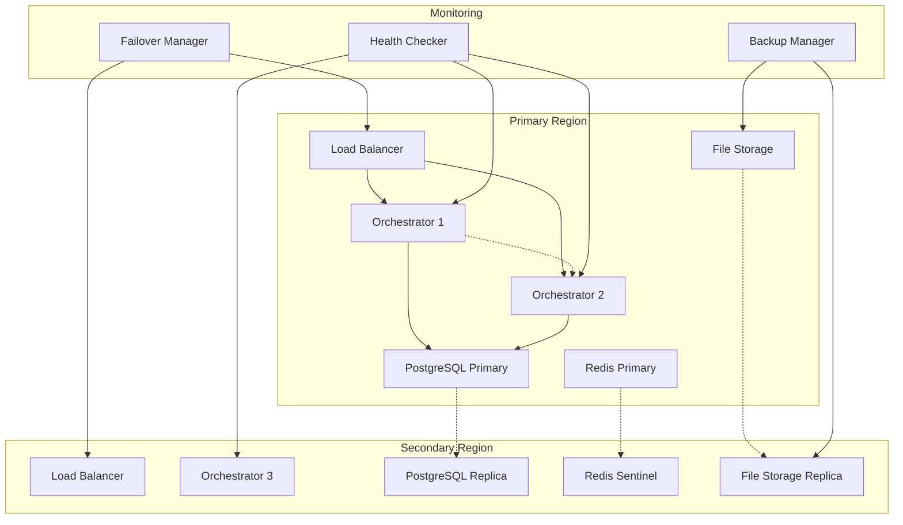

# High Availability (HA) Implementation Plan

## 🎯 Objective

Implement enterprise-grade High Availability features to ensure GitHub-RunnerHub can operate with maximum uptime, automated failover, and disaster recovery capabilities.

## 📋 Implementation Tasks

### 1. Orchestrator Redundancy
- **Goal**: Multi-node orchestrator deployment with leader election
- **Components**:
  - Leader election mechanism using etcd/Redis
  - Active-passive orchestrator nodes
  - Seamless failover between nodes
  - Shared state management
- **Success Criteria**: 
  - Zero downtime during orchestrator failover
  - Automatic leader re-election within 30 seconds
  - State consistency across all nodes

### 2. Failover Mechanisms
- **Goal**: Automated detection and recovery from component failures
- **Components**:
  - Health monitoring for all critical components
  - Automatic failover triggers
  - Graceful service migration
  - Circuit breaker patterns
- **Success Criteria**:
  - < 10 second detection of component failure
  - Automatic failover with < 30 second recovery time
  - Zero job loss during failover events

### 3. Data Replication
- **Goal**: Multi-region data replication with consistency guarantees
- **Components**:
  - PostgreSQL master-slave replication
  - Redis Sentinel for cache replication
  - File system replication for logs/artifacts
  - Cross-region backup synchronization
- **Success Criteria**:
  - < 5 second replication lag
  - 99.99% data consistency
  - Automated failover to replica databases

### 4. Health Checks
- **Goal**: Comprehensive health monitoring with predictive alerting
- **Components**:
  - Deep health checks for all services
  - Dependency health validation
  - Performance baseline monitoring
  - Predictive failure detection
- **Success Criteria**:
  - < 1 second health check response times
  - 95% accuracy in failure prediction
  - Automated remediation for common issues

### 5. Disaster Recovery Procedures
- **Goal**: Complete system recovery with minimal data loss
- **Components**:
  - Automated backup procedures
  - Cross-region disaster recovery
  - Recovery time objective (RTO) < 15 minutes
  - Recovery point objective (RPO) < 5 minutes
- **Success Criteria**:
  - Full system recovery in < 15 minutes
  - < 5 minutes of data loss maximum
  - Automated disaster recovery testing

## 🏗️ Architecture Overview

## 🔧 Implementation Strategy

### Phase 1: Foundation (2-3 hours)
1. **Setup multi-node orchestrator infrastructure**
   - Create orchestrator redundancy
   - Implement leader election
   - Test failover mechanisms

### Phase 2: Data Layer HA (3-4 hours)
2. **Implement data replication**
   - PostgreSQL replication setup
   - Redis Sentinel configuration
   - File system replication

### Phase 3: Health & Monitoring (2-3 hours)
3. **Deploy comprehensive health checks**
   - Service health monitoring
   - Dependency validation
   - Performance monitoring

### Phase 4: Failover Automation (3-4 hours)
4. **Build automated failover**
   - Failure detection
   - Automatic service migration
   - Recovery procedures

### Phase 5: Disaster Recovery (2-3 hours)
5. **Implement disaster recovery**
   - Backup automation
   - Cross-region DR
   - Recovery testing

## 📊 Success Metrics

| Metric | Target | Current |
|--------|---------|---------|
| **Uptime** | 99.99% | 99.9% |
| **Recovery Time** | < 15 min | 30+ min |
| **Data Loss** | < 5 min | 15+ min |
| **Failover Time** | < 30 sec | Manual |
| **Health Check Latency** | < 1 sec | 5+ sec |

## 🛠️ Technology Stack

- **Orchestration**: Docker Swarm/Kubernetes
- **Database**: PostgreSQL with streaming replication
- **Cache**: Redis with Sentinel
- **Load Balancing**: HAProxy/Nginx
- **Monitoring**: Prometheus + Grafana + AlertManager
- **Service Discovery**: etcd/Consul
- **File Storage**: Network-attached storage with replication

## 🚨 Risk Mitigation

1. **Split-brain scenarios**: Implement proper quorum mechanisms
2. **Network partitions**: Design for CAP theorem considerations  
3. **Data corruption**: Regular integrity checks and point-in-time recovery
4. **Cascading failures**: Circuit breakers and rate limiting
5. **Human errors**: Automated procedures and validation steps

## ✅ Testing Strategy

1. **Chaos Engineering**: Randomly terminate services to test resilience
2. **Disaster Recovery Drills**: Monthly full DR tests
3. **Performance Testing**: Load testing under failure scenarios
4. **Integration Testing**: End-to-end HA workflow validation
5. **Security Testing**: Validate HA doesn't compromise security

## 📋 Implementation Checklist

- [ ] Multi-node orchestrator setup
- [ ] Leader election implementation
- [ ] PostgreSQL replication configuration
- [ ] Redis Sentinel setup
- [ ] Health check system deployment
- [ ] Automated failover mechanisms
- [ ] Cross-region backup sync
- [ ] Disaster recovery procedures
- [ ] HA monitoring dashboards
- [ ] Load testing validation
- [ ] Security audit of HA components
- [ ] Documentation and runbooks
- [ ] Team training on HA operations

## 🔄 Maintenance Plan

- **Daily**: Automated health checks and performance monitoring
- **Weekly**: Backup integrity validation and replication lag monitoring
- **Monthly**: Disaster recovery testing and failover drills
- **Quarterly**: HA architecture review and optimization
- **Annually**: Full DR site validation and business continuity testing

This comprehensive HA implementation will provide enterprise-grade reliability and ensure GitHub-RunnerHub can handle mission-critical workloads with confidence.