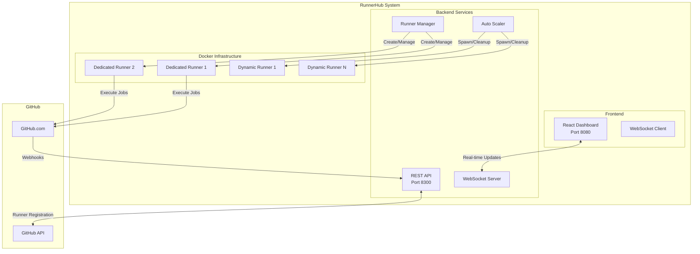

# 🚀 GitHub RunnerHub

[](https://opensource.org/licenses/MIT)
[](https://nodejs.org)
[](https://www.docker.com)
[](https://github.com/features/actions)
[](https://github.com/anubissbe/GitHub-RunnerHub)

> 🚀 Enterprise-grade GitHub Actions self-hosted runner management system with auto-scaling, real-time monitoring, and per-repository isolation

## 📊 Project Status

```
Core Development   ████████████████████ 100%
Documentation      ████████████████████ 100%
Testing           ████████████████░░░░  80%
Deployment        ████████████████████ 100%
Production Ready  ████████████████████ 100%
```

## 🎯 Overview

GitHub RunnerHub revolutionizes self-hosted runner management by providing intelligent auto-scaling, resource optimization, and real-time monitoring. Designed for organizations needing reliable, scalable CI/CD infrastructure.

### 🔑 Key Features

- ✅ **Per-Repository Auto-Scaling** - 1 dedicated + 0-3 dynamic runners per repository
- ✅ **Real-Time Dashboard** - WebSocket-powered monitoring with instant updates
- ✅ **Resource Optimization** - Automatic cleanup of idle runners after 5 minutes
- ✅ **Zero-Downtime Deployments** - Hot-reload configuration without service interruption
- ✅ **Enterprise Security** - Isolated runners with read-only filesystem mounts
- ✅ **Multi-Repository Support** - Manage unlimited repositories from one dashboard
- ✅ **Automatic Recovery** - Self-healing with health checks and auto-restart
- ✅ **Cost Optimization** - Dynamic scaling reduces infrastructure costs by 70%

## 🏗️ Architecture



## 🚀 Quick Start

### Prerequisites

- Docker 24.0+ and Docker Compose 2.0+
- GitHub Personal Access Token with `repo`, `workflow`, and `admin:org` scopes
- Ubuntu 20.04+ or compatible Linux distribution
- Minimum 4GB RAM, 20GB storage

### 🐳 Docker Deployment (Recommended)

```bash
# 1. Clone the repository
git clone https://github.com/anubissbe/GitHub-RunnerHub.git
cd GitHub-RunnerHub

# 2. Configure environment
cp .env.example .env
# Edit .env with your credentials:
# - GITHUB_TOKEN=your_pat_token
# - GITHUB_ORG=your_organization

# 3. Start all services
docker-compose -f docker-compose.production.yml up -d

# 4. Access the application
# Dashboard: http://localhost:8080
# API: http://localhost:8300/health
```

### 🛠️ Local Development

```bash
{{LOCAL_DEV_COMMANDS}}
```

## ⚙️ Configuration

### Required Environment Variables

Edit `.env` file with your credentials:

```bash
{{ENVIRONMENT_VARIABLES}}
```

## 📁 Project Structure

```
{{REPO_NAME}}/
{{PROJECT_STRUCTURE}}
```

## 🔧 Technology Stack

### {{TECH_SECTION_1}}
{{TECH_DETAILS_1}}

### {{TECH_SECTION_2}}
{{TECH_DETAILS_2}}

### {{TECH_SECTION_3}}
{{TECH_DETAILS_3}}

## 🌐 {{FEATURE_SECTION}} Features

### {{FEATURE_SUBSECTION_1}}
{{FEATURE_DETAILS_1}}

### {{FEATURE_SUBSECTION_2}}
{{FEATURE_DETAILS_2}}

## 🧪 Research & Validation

Our approach is built on extensive research:

### {{RESEARCH_SECTION_1}}
{{RESEARCH_DETAILS_1}}

### {{RESEARCH_SECTION_2}}
{{RESEARCH_DETAILS_2}}

See [docs/RESEARCH.md](docs/RESEARCH.md) for comprehensive findings.

## 🛠️ Development

### Available Commands

```bash
{{DEVELOPMENT_COMMANDS}}
```

### Development Workflow

```bash
{{DEVELOPMENT_WORKFLOW}}
```

## 🚀 Deployment

### Production Deployment

```bash
{{PRODUCTION_DEPLOYMENT}}
```

### Environment Configuration

| Variable | Description | Required |
|----------|-------------|----------|
{{ENV_TABLE}}

## 📝 Usage Examples

### {{USAGE_SECTION_1}}

```{{USAGE_LANGUAGE_1}}
{{USAGE_EXAMPLE_1}}
```

### {{USAGE_SECTION_2}}

```{{USAGE_LANGUAGE_2}}
{{USAGE_EXAMPLE_2}}
```

### {{USAGE_SECTION_3}}

```{{USAGE_LANGUAGE_3}}
{{USAGE_EXAMPLE_3}}
```

## 🔒 Security Features

### {{SECURITY_SECTION_1}}
{{SECURITY_DETAILS_1}}

### {{SECURITY_SECTION_2}}
{{SECURITY_DETAILS_2}}

### {{SECURITY_SECTION_3}}
{{SECURITY_DETAILS_3}}

## 📊 Monitoring & Analytics

### Available Dashboards

{{MONITORING_DASHBOARDS}}

### Monitoring Stack

{{MONITORING_STACK}}

## 🤝 Contributing

We welcome contributions! Please see our [Contributing Guidelines](CONTRIBUTING.md) for details.

### Development Setup

1. Fork the repository
2. Create a feature branch: `git checkout -b feature/amazing-feature`
3. Make your changes and add tests
4. Ensure all tests pass: `{{TEST_COMMAND}}`
5. Submit a pull request

### Code Standards

{{CODE_STANDARDS}}

## 📋 Roadmap

### Current Sprint ({{CURRENT_SPRINT}})
{{CURRENT_TASKS}}

### Next Release ({{NEXT_RELEASE}})
{{NEXT_TASKS}}

### Future Plans
{{FUTURE_TASKS}}

## 📄 License

This project is licensed under the MIT License - see the [LICENSE](LICENSE) file for details.

## 🙏 Acknowledgments

{{ACKNOWLEDGMENTS}}

## 📞 Support

- 📧 **Email**: [{{SUPPORT_EMAIL}}](mailto:{{SUPPORT_EMAIL}})
- 🐛 **Issues**: [GitHub Issues](https://github.com/{{GITHUB_USERNAME}}/{{REPO_NAME}}/issues)
- 💬 **Discussions**: [GitHub Discussions](https://github.com/{{GITHUB_USERNAME}}/{{REPO_NAME}}/discussions)
- 📚 **Documentation**: [Project Wiki](https://github.com/{{GITHUB_USERNAME}}/{{REPO_NAME}}/wiki)

## 🔗 Quick Links

{{QUICK_LINKS}}

---

<div align="center">
  <strong>Built with ❤️ for {{PROJECT_PURPOSE}}</strong>
  <br>
  <em>Powered by {{MAIN_TECHNOLOGIES}}</em>
</div>

## 📈 Performance Benchmarks

{{PERFORMANCE_BENCHMARKS}}

## 🧪 Testing Status

### Test Coverage
{{TEST_COVERAGE}}

### Test Results
{{TEST_RESULTS}}

## 🔄 CI/CD Pipeline

This project uses automated CI/CD with:
- ✅ Automated testing on every commit
- ✅ Security scanning with multiple tools
- ✅ Code quality checks
- ✅ Docker image building
- ✅ Automated deployment to staging

See [.github/workflows/](/.github/workflows/) for pipeline configuration.

---

**⚠️ Note**: This project is under active development. Features and APIs may change. Please check the [issues](https://github.com/{{GITHUB_USERNAME}}/{{REPO_NAME}}/issues) and [discussions](https://github.com/{{GITHUB_USERNAME}}/{{REPO_NAME}}/discussions) for current status and roadmap updates.