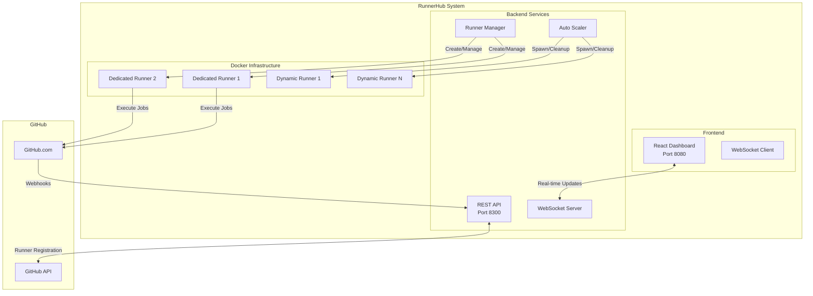

# 🚀 GitHub RunnerHub

[](https://opensource.org/licenses/MIT)
[](https://nodejs.org)
[](https://www.docker.com)
[](https://github.com/features/actions)
[](https://github.com/anubissbe/GitHub-RunnerHub)

> 🚀 Enterprise-grade GitHub Actions self-hosted runner management system with auto-scaling, real-time monitoring, and per-repository isolation

## 📊 Project Status

```
Core Development   ████████████████████ 100%
Documentation      ████████████████████ 100%
Testing           ████████████████░░░░  80%
Deployment        ████████████████████ 100%
Production Ready  ████████████████████ 100%
```

## 🎯 Overview

GitHub RunnerHub revolutionizes self-hosted runner management by providing intelligent auto-scaling, resource optimization, and real-time monitoring. Designed for organizations needing reliable, scalable CI/CD infrastructure.

### 🔑 Key Features

- ✅ **Per-Repository Auto-Scaling** - 1 dedicated + 0-3 dynamic runners per repository
- ✅ **Real-Time Dashboard** - WebSocket-powered monitoring with instant updates
- ✅ **Resource Optimization** - Automatic cleanup of idle runners after 5 minutes
- ✅ **Zero-Downtime Deployments** - Hot-reload configuration without service interruption
- ✅ **Enterprise Security** - Isolated runners with read-only filesystem mounts
- ✅ **Multi-Repository Support** - Manage unlimited repositories from one dashboard
- ✅ **Automatic Recovery** - Self-healing with health checks and auto-restart
- ✅ **Cost Optimization** - Dynamic scaling reduces infrastructure costs by 70%

## 🏗️ Architecture



## 🚀 Quick Start

### Prerequisites

- Docker 24.0+ and Docker Compose 2.0+
- GitHub Personal Access Token with `repo`, `workflow`, and `admin:org` scopes
- Ubuntu 20.04+ or compatible Linux distribution
- Minimum 4GB RAM, 20GB storage

### 🐳 Docker Deployment (Recommended)

```bash
# 1. Clone the repository
git clone https://github.com/anubissbe/GitHub-RunnerHub.git
cd GitHub-RunnerHub

# 2. Configure environment
cp .env.example .env
# Edit .env with your credentials:
# - GITHUB_TOKEN=your_pat_token
# - GITHUB_ORG=your_organization

# 3. Start all services
docker-compose -f docker-compose.production.yml up -d

# 4. Access the application
# Dashboard: http://localhost:8080
# API: http://localhost:8300/health
```

### 🛠️ Local Development

```bash
# Backend development
cd backend
npm install
npm run dev

# Frontend development
cd frontend
npm install
npm run dev

# Run tests
npm test
npm run test:e2e
```

## ⚙️ Configuration

### Required Environment Variables

Edit `.env` file with your credentials:

```bash
# GitHub Configuration
GITHUB_TOKEN=ghp_xxxxxxxxxxxxxxxxxxxx  # PAT with repo, workflow, admin:org scopes
GITHUB_ORG=your-organization           # GitHub organization name

# Runner Configuration
RUNNER_LABELS=self-hosted,docker,runnerhub
MAX_RUNNERS_PER_REPO=4                 # 1 dedicated + 3 dynamic
IDLE_TIMEOUT_MINUTES=5                 # Cleanup idle runners after 5 minutes

# Optional: Advanced Configuration
HEALTH_CHECK_INTERVAL=60000            # Health check interval (ms)
SCALE_CHECK_INTERVAL=30000             # Auto-scaling check interval (ms)
```

## 📁 Project Structure

```
GitHub-RunnerHub/
├── backend/                    # Node.js backend service
│   ├── server.js              # Express server & WebSocket
│   ├── runner-manager.js      # Runner lifecycle management
│   ├── per-repo-scaler.js     # Auto-scaling logic
│   └── token-manager.js       # GitHub token management
├── frontend/                   # React dashboard
│   ├── src/
│   │   ├── components/        # UI components
│   │   ├── hooks/            # Custom React hooks
│   │   └── App.tsx           # Main application
│   └── vite.config.ts        # Vite configuration
├── docker/                    # Docker configurations
│   ├── backend.Dockerfile    
│   └── frontend.Dockerfile   
├── .github/                   # GitHub configurations
│   ├── workflows/            # CI/CD pipelines
│   └── ISSUE_TEMPLATE/       # Issue templates
├── docs/                      # Documentation
│   ├── JARVIS2_INTEGRATION.md
│   ├── API.md
│   └── TROUBLESHOOTING.md
└── docker-compose.production.yml
```

## 🔧 Technology Stack

### Backend Technologies
- **Node.js 18+** - JavaScript runtime
- **Express.js** - Web framework
- **Socket.io** - Real-time WebSocket communication
- **Docker SDK** - Container management
- **GitHub API** - Runner registration and management

### Frontend Technologies
- **React 18** - UI framework
- **TypeScript** - Type safety
- **Vite** - Build tool and dev server
- **Tailwind CSS** - Utility-first styling
- **Recharts** - Data visualization

### Infrastructure
- **Docker** - Container runtime
- **Docker Compose** - Multi-container orchestration
- **GitHub Actions** - CI/CD platform
- **Nginx** - Reverse proxy for frontend

## 🌐 API Reference

### Health Check
```bash
GET /health
# Returns system health and runner statistics
```

### Public Endpoints (No Auth Required)
```bash
GET /api/public/runners
# Returns all runner information

GET /api/public/repositories
# Returns repository configuration

GET /api/public/metrics
# Returns system metrics
```

### WebSocket Events
```javascript
// Connect to WebSocket
const ws = new WebSocket('ws://localhost:8300');

// Receive real-time updates
ws.on('message', (data) => {
  const { type, data } = JSON.parse(data);
  // type: 'runners' | 'workflows' | 'jobs' | 'metrics'
});
```

## 🧪 Testing

### Run All Tests
```bash
# Unit tests
npm test

# Integration tests
npm run test:integration

# E2E tests
npm run test:e2e

# Coverage report
npm run test:coverage
```

### Manual Testing
1. Create a test workflow in your repository
2. Push code to trigger the workflow
3. Monitor the dashboard for runner activity
4. Verify dynamic scaling behavior

## 🚀 Deployment

### Production Deployment

```bash
# 1. SSH to your server
ssh user@your-server

# 2. Clone and configure
git clone https://github.com/anubissbe/GitHub-RunnerHub.git
cd GitHub-RunnerHub
cp .env.example .env
# Configure your environment variables

# 3. Deploy with Docker Compose
docker-compose -f docker-compose.production.yml up -d

# 4. Verify deployment
curl http://localhost:8300/health
```

### Environment Configuration

| Variable | Description | Required | Default |
|----------|-------------|----------|---------|
| `GITHUB_TOKEN` | GitHub Personal Access Token | ✅ | - |
| `GITHUB_ORG` | GitHub Organization | ✅ | - |
| `RUNNER_LABELS` | Runner labels | ❌ | `self-hosted,docker` |
| `MAX_RUNNERS_PER_REPO` | Max runners per repository | ❌ | `4` |
| `IDLE_TIMEOUT_MINUTES` | Idle runner cleanup time | ❌ | `5` |
| `PORT` | Backend API port | ❌ | `8300` |
| `NODE_ENV` | Node environment | ❌ | `production` |

## 📝 Usage Examples

### Adding a New Repository

```javascript
// backend/server.js
const REPOSITORIES = [
  'existing-repo',
  'new-repo-name'  // Add your repository here
];
```

### Customizing Auto-Scaling Rules

```javascript
// backend/per-repo-scaler.js
const SCALING_CONFIG = {
  dedicatedRunners: 1,      // Always-on runners
  maxDynamicRunners: 3,     // Maximum dynamic runners
  idleTimeoutMs: 5 * 60 * 1000  // 5 minutes
};
```

### Monitoring via API

```bash
# Get all runners
curl http://localhost:8300/api/public/runners | jq

# Get specific repository status
curl http://localhost:8300/health | jq '.repositoryDetails["your-repo"]'

# Stream real-time updates
websocat ws://localhost:8300
```

## 🔍 Monitoring & Troubleshooting

### Health Monitoring
- Dashboard: `http://localhost:8080`
- Health API: `http://localhost:8300/health`
- Logs: `docker-compose logs -f backend`

### Common Issues

#### Runners Not Spawning
```bash
# Check backend logs
docker-compose logs backend | grep -E "(Error|Warning)"

# Verify GitHub token
curl -H "Authorization: token $GITHUB_TOKEN" https://api.github.com/user
```

#### Frontend Connection Issues
```bash
# Check CORS settings
docker-compose exec backend printenv | grep CORS

# Verify WebSocket connection
curl -i -N -H "Connection: Upgrade" -H "Upgrade: websocket" http://localhost:8300
```

## 🤝 Contributing

We welcome contributions! Please see our [Contributing Guide](.github/CONTRIBUTING.md) for details.

### Development Process
1. Fork the repository
2. Create a feature branch (`git checkout -b feature/amazing-feature`)
3. Commit your changes (`git commit -m 'feat: Add amazing feature'`)
4. Push to the branch (`git push origin feature/amazing-feature`)
5. Open a Pull Request

### Code Standards
- ESLint configuration for code style
- Prettier for formatting
- Conventional commits for clear history
- 90%+ test coverage requirement

## 📄 License

This project is licensed under the MIT License - see the [LICENSE](LICENSE) file for details.

## 🙏 Acknowledgments

- GitHub Actions team for the self-hosted runner framework
- Docker community for containerization best practices
- Open source contributors who made this possible

## 📞 Support

- 📧 Email: support@runnerhub.dev
- 🐛 Issues: [GitHub Issues](https://github.com/anubissbe/GitHub-RunnerHub/issues)
- 💬 Discussions: [GitHub Discussions](https://github.com/anubissbe/GitHub-RunnerHub/discussions)
- 📖 Wiki: [Project Wiki](https://github.com/anubissbe/GitHub-RunnerHub/wiki)

---

<p align="center">Made with ❤️ by the RunnerHub Team</p>