# 🏃 GitHub RunnerHub

<div align="center">


**Enterprise-grade self-hosted GitHub Actions runner infrastructure with auto-scaling, monitoring, and multi-repository support**

[Installation](#-installation) • [Features](#-features) • [Architecture](#-architecture) • [Wiki](https://github.com/anubissbe/GitHub-RunnerHub/wiki) • [Support](#-support)

<a href="https://www.buymeacoffee.com/anubissbe" target="_blank">
  
</a>

</div>

---

## 🚀 Features

- **🔄 Smart Auto-Scaling**: 1 dedicated runner per repo + dynamic scaling (0-3 extra per repo)
- **📊 Real-time Dashboard**: Monitor runners, workflows, and metrics at a glance
- **🏢 Multi-Repository**: Each repo has dedicated runners with independent scaling
- **🔐 Secure**: Runs in Docker containers with isolated environments
- **💰 Cost-Effective**: Eliminate GitHub Actions minutes charges
- **🔡 Token Refresh**: Automatic token renewal prevents runner disconnections
- **🎨 Beautiful UI**: Black/orange themed dashboard matching your brand
- **🧠 Intelligent Resource Management**: 
  - Spawns runners only when needed (all runners busy)
  - Removes dynamic runners after 5 minutes idle
  - Maintains 1 dedicated runner per repo (always ready)

## 📸 Screenshots

<div align="center">
  
  <p><i>Real-time monitoring dashboard showing runner status and metrics</i></p>
</div>

## ⚡ Quick Start

```bash
# Clone the repository
git clone https://github.com/anubissbe/GitHub-RunnerHub.git
cd GitHub-RunnerHub

# Run the installer (requires only GitHub token)
./install.sh

# Access the dashboard
open http://localhost:8080
```

## 📋 Requirements

- Docker 20.10+
- Linux server (Ubuntu 20.04+ recommended)
- GitHub Personal Access Token with `repo` and `admin:org` scopes
- Minimum 4GB RAM, 20GB storage

## 🏗️ Architecture

```mermaid
graph TB
    subgraph "GitHub RunnerHub System"
        Frontend["🎨 Frontend<br/>(React + Vite)"]
        Backend["⚙️ Backend<br/>(Node.js + Express)"]
        AutoScaler["🤖 Smart Auto-Scaler<br/>(Per-Repo Scaling)"]
        
        subgraph "Dedicated Runners (Always Ready)"
            D1["🏃 ProjectHub-Mcp"]
            D2["🏃 JarvisAI"]
            D3["🏃 GitHub-RunnerHub"]
            DN["🏃 Other Repos<br/>(1 per repo)"]
        end
        
        subgraph "Dynamic Runners (On-Demand)"
            Dyn1["⚡ Dynamic 1<br/>(spawned when busy)"]
            Dyn2["⚡ Dynamic 2<br/>(auto-removed after 5m)"]
            DynN["⚡ Dynamic N<br/>(max 3 per repo)"]
        end
    end
    
    GitHub["🐙 GitHub API"]
    Docker["🐳 Docker Engine"]
    
    Frontend <--> Backend
    Backend <--> GitHub
    Backend <--> Docker
    Backend <--> AutoScaler
    AutoScaler --> Docker
    
    Docker --> D1
    Docker --> D2
    Docker --> D3
    Docker --> DN
    Docker -.-> Dyn1
    Docker -.-> Dyn2
    Docker -.-> DynN
    
    D1 --> GitHub
    D2 --> GitHub
    D3 --> GitHub
    Dyn1 -.-> GitHub
    Dyn2 -.-> GitHub
```



### How Auto-Scaling Works

1. **Base Setup**: 1 dedicated runner per repository (always ready, zero cold start)
2. **Monitoring**: Auto-scaler checks all repos every 30 seconds
3. **Scale UP**: When a repo has no free runners:
   - Spawns 1-3 dynamic runners for that specific repo
   - New runners ready in ~30 seconds
4. **Scale DOWN**: When dynamic runners are idle for 5 minutes:
   - Automatically removes them to save resources
   - Dedicated runner always remains
5. **Per-Repo Independence**: Each repository scales independently

#### Example Scenario:
```
Normal State:
ProjectHub-Mcp:    [🏃 Dedicated (idle)]
JarvisAI:          [🏃 Dedicated (idle)]

4 PRs arrive at ProjectHub-Mcp:
ProjectHub-Mcp:    [🏃 Dedicated (busy)] + [⚡ Dynamic-1 (busy)] + [⚡ Dynamic-2 (busy)] + [⚡ Dynamic-3 (busy)]
JarvisAI:          [🏃 Dedicated (idle)]

After workflows complete + 5 minutes:
ProjectHub-Mcp:    [🏃 Dedicated (idle)]  (dynamics auto-removed)
JarvisAI:          [🏃 Dedicated (idle)]
```

### Components

- **Monitoring Dashboard**: React-based UI with real-time updates
- **Backend API**: Express.js server managing runners and GitHub integration
- **Auto-Scaling Engine**: Intelligent scaling based on utilization thresholds
- **Runner Pool**: Docker containers running GitHub Actions runners
- **WebSocket Server**: Real-time communication for live updates

## 📦 Installation

### Prerequisites

- Docker 20.0.0 or higher
- Docker Compose 2.0.0 or higher
- Node.js 18.0.0 or higher (for development)
- GitHub Personal Access Token with `repo` and `admin:org` scopes

### Automated Installation

```bash
./install.sh
```

The installer will:
1. Check system requirements
2. Prompt for your GitHub token
3. Configure the environment
4. Build Docker images
5. Start the services
6. Display the dashboard URL

### Manual Installation

1. **Clone the repository**
   ```bash
   git clone https://github.com/anubissbe/GitHub-RunnerHub.git
   cd GitHub-RunnerHub
   ```

2. **Configure environment**
   ```bash
   cp .env.example .env
   # Edit .env and add your GITHUB_TOKEN
   ```

3. **Build and start services**
   ```bash
   docker-compose up -d
   ```

4. **Access the dashboard**
   ```
   http://localhost:8080
   ```

## ⚙️ Configuration

### Environment Variables

| Variable | Description | Default |
|----------|-------------|---------|
| `GITHUB_TOKEN` | GitHub Personal Access Token | Required |
| `GITHUB_ORG` | GitHub organization name | Required |
| `GITHUB_REPO` | Repository name | Required |
| `MIN_RUNNERS` | Minimum number of runners | 5 |
| `MAX_RUNNERS` | Maximum number of runners | 50 |
| `SCALE_THRESHOLD` | Utilization threshold for scaling | 0.8 |
| `SCALE_INCREMENT` | Number of runners to add | 5 |
| `API_PORT` | Backend API port | 8300 |
| `UI_PORT` | Dashboard UI port | 8080 |

### Auto-Scaling Configuration

The optimal auto-scaling configuration:

```json
{
  "dedicatedRunnersPerRepo": 1,
  "maxDynamicPerRepo": 3,
  "scaleUpTrigger": "all runners busy",
  "scaleDownTrigger": "5 minutes idle",
  "checkInterval": 30,
  "repositories": [
    "ProjectHub-Mcp",
    "JarvisAI",
    "GitHub-RunnerHub",
    "// ... all your repos"
  ]
}
```

**Key Differences from Traditional Scaling:**
- **Per-Repository Scaling**: Each repo scales independently
- **Always Ready**: 1 dedicated runner per repo (never removed)
- **Smart Spawning**: Only spawns when ALL runners for a repo are busy
- **Automatic Cleanup**: Removes idle dynamic runners after 5 minutes

## 🔌 API Reference

### Endpoints

#### Get Runner Status
```http
GET /api/runners
```

#### Get Active Workflows
```http
GET /api/workflows/active
```

#### Get Metrics
```http
GET /api/metrics
```

#### Scale Runners
```http
POST /api/runners/scale
{
  "action": "up" | "down",
  "count": 5
}
```

#### Health Check
```http
GET /health
```

### WebSocket Events

Connect to `ws://localhost:8300` for real-time updates:

- `connected` - Initial connection confirmation
- `scale` - Auto-scaling events (up/down with details)
- `update` - Cache updates with runner/workflow counts
- `runner:status` - Runner status changes
- `workflow:start` - Workflow started
- `workflow:complete` - Workflow completed
- `metrics:update` - Metrics updated

Example WebSocket client:
```javascript
const ws = new WebSocket('ws://localhost:8300');

ws.on('message', (data) => {
  const { event, data: payload } = JSON.parse(data);
  console.log(`Event: ${event}`, payload);
});
```

## 🎨 UI Customization

The UI follows the ProjectHub-Mcp design system:

- **Primary Color**: #ff6500 (Orange)
- **Background**: #0a0a0a (Near Black)
- **Surface**: #1a1a1a (Dark Gray)
- **Text**: #ffffff (White)

To customize, edit `frontend/src/styles/theme.css`.

## 🧪 Development

### Local Development

```bash
# Backend
cd backend
npm install
npm run dev

# Frontend
cd frontend
npm install
npm run dev
```

### Running Tests

```bash
npm test
```

### Building for Production

```bash
docker-compose build
```

## 📊 Monitoring

The dashboard provides:

- **Runner Overview**: Status of all runners (Ready, Busy, Offline)
- **Per-Repository View**: 
  - Dedicated runners (always visible)
  - Dynamic runners (when active)
  - Current scaling status
- **Utilization Metrics**: Current usage percentage and trends
- **Active Workflows**: Real-time view of running workflows
- **Job Distribution**: Which runners are handling which jobs
- **Auto-Scaling Events**:
  - When dynamic runners spawn
  - Which repository triggered scaling
  - When runners are removed
- **Resource Efficiency**: Track dedicated vs dynamic runner usage

## 🔒 Security

- GitHub tokens are stored securely in environment variables
- WebSocket connections include error handling and timestamps
- Docker socket access is controlled and monitored
- Health checks ensure service reliability
- TLS/SSL support ready for production deployments

## 📱 Screenshots

### Dashboard Overview
- Real-time runner status monitoring
- Live utilization metrics with charts
- Active workflow tracking
- Auto-scaling event history

### Auto-Scaling in Action
- Automatic runner spawning at 80% utilization
- Graceful scale-down during low usage
- Configurable thresholds and increments

## 🤝 Contributing

We welcome contributions! Please see our [Contributing Guide](CONTRIBUTING.md) for details.

## 📄 License

This project is licensed under the MIT License - see the [LICENSE](LICENSE) file for details.

## 🙏 Acknowledgments

- Inspired by [ProjectHub-Mcp](https://github.com/anubissbe/ProjectHub-Mcp) design system
- Built with React, Node.js, and Docker
- Powered by GitHub Actions API

## 💬 Support

- 📚 [Documentation Wiki](https://github.com/anubissbe/GitHub-RunnerHub/wiki)
- 🐛 [Issue Tracker](https://github.com/anubissbe/GitHub-RunnerHub/issues)
- 💬 [Discussions](https://github.com/anubissbe/GitHub-RunnerHub/discussions)
- ☕ [Buy Me a Coffee](https://www.buymeacoffee.com/anubissbe)

## 🙏 Acknowledgments

- Built with ❤️ using Docker and Node.js
- Inspired by the need for cost-effective CI/CD
- Special thanks to all contributors

---

<div align="center">

**If you find RunnerHub useful, please consider [buying me a coffee](https://www.buymeacoffee.com/anubissbe) ☕**

Made with 🧡 by [anubissbe](https://github.com/anubissbe)

</div>## 🚦 Understanding GitHub Runner Limitations

**Important**: GitHub runners are repository-specific on Free/Team plans:
- Each runner can only work for ONE repository
- No "organization-level" runners without Enterprise
- RunnerHub works around this intelligently!

### RunnerHub's Solution:
1. **Dedicated Runners**: 1 per repo = instant response
2. **Dynamic Scaling**: Spawn extras only when needed
3. **Smart Allocation**: Each repo manages its own pool
4. **Cost Effective**: $0 vs $1,050+/month for Enterprise

This gives you 90% of Enterprise benefits on the Free plan! 🎉
