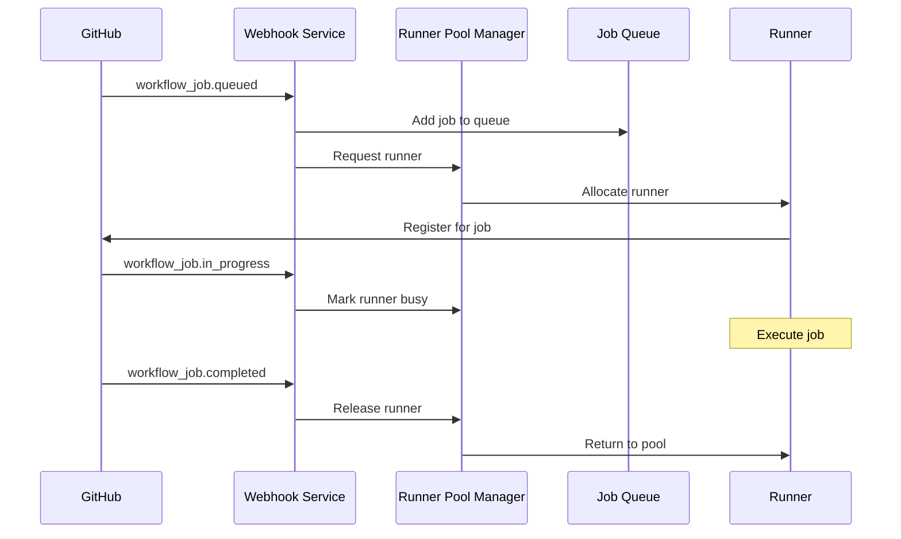

# GitHub Webhook Integration

## Overview

The GitHub Webhook Integration provides real-time event processing for GitHub Actions workflows, enabling the RunnerHub to automatically respond to workflow jobs, manage runner allocation, and track job execution in real-time.

## Key Features

- **Real-time Event Processing**: Instant response to GitHub webhook events
- **Secure Signature Validation**: HMAC-SHA256 signature verification
- **Intelligent Job Prioritization**: Priority-based job queue management
- **Automatic Runner Management**: Dynamic runner allocation and release
- **Comprehensive Event Tracking**: Full audit trail of webhook events
- **Multi-Event Support**: Handles workflow jobs, runs, pushes, and pull requests
- **Error Handling & Retry Logic**: Robust error recovery mechanisms

## Architecture

### Components

1. **GitHubWebhookService**: Core webhook processing engine
   - Event validation and signature verification
   - Multi-event type handling
   - Database persistence
   - Real-time event emission

2. **WebhookController**: HTTP request handling
   - RESTful API endpoints
   - Request validation
   - Response formatting
   - Error handling

3. **Webhook Middleware**: Request processing pipeline
   - Signature validation
   - Header validation
   - Request logging
   - Rate limiting

4. **Database Schema**: Event persistence
   - `webhook_events`: Complete webhook audit trail
   - `workflow_runs`: Workflow run tracking
   - `jobs`: Job status management

## Supported Webhook Events

### 1. Workflow Job Events
The primary events for runner management:

#### `workflow_job.queued`
- **Purpose**: New job requiring runner allocation
- **Actions**:
  - Add job to processing queue
  - Request runner from pool
  - Calculate job priority
  - Emit allocation events

#### `workflow_job.in_progress`
- **Purpose**: Job execution started
- **Actions**:
  - Update job status to running
  - Mark runner as busy
  - Record start timestamp
  - Track runner assignment

#### `workflow_job.completed`
- **Purpose**: Job execution finished
- **Actions**:
  - Update job status and conclusion
  - Release runner back to pool
  - Record completion metrics
  - Calculate execution duration

### 2. Workflow Run Events
Track overall workflow execution:

#### `workflow_run.*`
- **Purpose**: Workflow-level tracking
- **Actions**:
  - Store workflow metadata
  - Track workflow status
  - Monitor workflow conclusions

### 3. Repository Events
Trigger proactive actions:

#### `push`
- **Purpose**: Code changes that may trigger workflows
- **Actions**:
  - Pre-warm runner pools
  - Prepare for expected jobs
  - Emit repository events

#### `pull_request`
- **Purpose**: PR events that may require CI/CD
- **Actions**:
  - Prepare runners for PR workflows
  - Track PR-specific jobs
  - Emit PR events

### 4. Administrative Events

#### `ping`
- **Purpose**: Webhook health verification
- **Actions**:
  - Confirm webhook connectivity
  - Log webhook configuration
  - Emit ping events

## API Reference

### Webhook Endpoint

#### POST /api/webhooks/github
Receive GitHub webhook events.

**Headers:**
- `X-GitHub-Event`: Event type (required)
- `X-GitHub-Delivery`: Unique delivery ID (required)
- `X-Hub-Signature-256`: HMAC signature (required if secret configured)
- `User-Agent`: GitHub-Hookshot/...

**Request Body:**
```json
{
  "action": "queued",
  "workflow_job": {
    "id": 12345,
    "run_id": 67890,
    "name": "Build and Test",
    "status": "queued",
    "labels": ["ubuntu-latest", "self-hosted"],
    "head_sha": "abc123def456",
    "html_url": "https://github.com/org/repo/actions/runs/67890/job/12345"
  },
  "repository": {
    "full_name": "org/repo",
    "private": false
  }
}
```

**Response:**
```json
{
  "success": true,
  "message": "Webhook processed successfully"
}
```

### Management Endpoints

#### GET /api/webhooks/events
Retrieve webhook events with filtering.

**Query Parameters:**
- `repository`: Filter by repository name
- `event`: Filter by event type
- `limit`: Maximum results (default: 100)
- `offset`: Pagination offset (default: 0)

**Response:**
```json
{
  "success": true,
  "data": {
    "events": [
      {
        "id": "delivery-12345",
        "repository": "org/repo",
        "event": "workflow_job",
        "action": "queued",
        "timestamp": "2024-01-01T12:00:00Z",
        "processed": true
      }
    ],
    "total": 1,
    "limit": 100,
    "offset": 0
  }
}
```

#### GET /api/webhooks/statistics
Get webhook processing statistics.

**Query Parameters:**
- `hours`: Time window in hours (default: 24)

**Response:**
```json
{
  "success": true,
  "data": {
    "timeWindow": "24 hours",
    "summary": {
      "totalEvents": 150,
      "processedEvents": 148,
      "pendingEvents": 2
    },
    "byEvent": [
      {
        "event": "workflow_job",
        "total": 100,
        "processed": 98,
        "pending": 2
      },
      {
        "event": "push",
        "total": 30,
        "processed": 30,
        "pending": 0
      }
    ]
  }
}
```

#### GET /api/webhooks/health
Check webhook service health.

**Response:**
```json
{
  "success": true,
  "data": {
    "status": "healthy",
    "recentEvents": 10,
    "lastEventTime": "2024-01-01T12:00:00Z",
    "hourlyStats": [
      {
        "event": "workflow_job",
        "total": 25,
        "processed": 25,
        "pending": 0
      }
    ]
  }
}
```

## Job Priority System

The webhook service implements intelligent job prioritization based on labels and repository characteristics:

### Priority Calculation

```typescript
function calculateJobPriority(labels: string[], repository: any): number {
  let priority = 0;

  // Production deployments (highest priority)
  if (labels.includes('production') || labels.includes('deploy')) {
    priority += 100;
  }

  // Critical or urgent jobs
  if (labels.includes('critical') || labels.includes('urgent')) {
    priority += 50;
  }

  // Smaller runners (faster allocation)
  if (labels.includes('ubuntu-latest') || labels.includes('small')) {
    priority += 10;
  }

  // Larger runners (slower allocation)
  if (labels.includes('large') || labels.includes('xl')) {
    priority -= 10;
  }

  return priority;
}
```

### Priority Examples

| Labels | Priority | Rationale |
|--------|----------|-----------|
| `["production", "deploy"]` | 100 | Critical production deployment |
| `["critical", "ubuntu-latest"]` | 60 | Urgent task with fast runner |
| `["ubuntu-latest"]` | 10 | Standard job with standard runner |
| `["large"]` | -10 | Large runner requires more resources |
| `["test", "small"]` | 10 | Test job with small runner |

## Security Configuration

### Webhook Secret Setup

1. **Generate Strong Secret**:
   ```bash
   openssl rand -hex 32
   ```

2. **Configure Environment**:
   ```bash
   export GITHUB_WEBHOOK_SECRET="your-webhook-secret"
   ```

3. **GitHub Repository Settings**:
   - Go to Repository → Settings → Webhooks
   - Add webhook URL: `https://your-domain.com/api/webhooks/github`
   - Set secret to match environment variable
   - Select events: `Workflow jobs`, `Workflow runs`, `Pushes`, `Pull requests`

### Signature Validation

The service validates webhook signatures using HMAC-SHA256:

```typescript
function verifySignature(payload: any, signature: string): boolean {
  const expectedSignature = crypto
    .createHmac('sha256', webhookSecret)
    .update(JSON.stringify(payload))
    .digest('hex');

  const actualSignature = signature.replace('sha256=', '');

  return crypto.timingSafeEqual(
    Buffer.from(expectedSignature, 'hex'),
    Buffer.from(actualSignature, 'hex')
  );
}
```

## Integration with Runner Management

### Runner Request Flow



### Runner Pool Integration

The webhook service integrates with the runner pool manager:

```typescript
// Request runner for queued job
const runnerRequest = await runnerPoolManager.requestRunner({
  labels: job.labels,
  repository: repository.full_name,
  jobId: job.id.toString(),
  priority: calculateJobPriority(job.labels, repository)
});

// Release runner when job completes
await runnerPoolManager.releaseRunner(job.runner_id.toString());
```

## Database Schema

### Webhook Events Table

```sql
CREATE TABLE runnerhub.webhook_events (
  id VARCHAR(255) PRIMARY KEY,
  repository VARCHAR(255) NOT NULL,
  event VARCHAR(100) NOT NULL,
  action VARCHAR(100),
  payload JSONB NOT NULL,
  signature VARCHAR(255),
  delivery_id VARCHAR(255) NOT NULL,
  timestamp TIMESTAMP NOT NULL DEFAULT CURRENT_TIMESTAMP,
  processed BOOLEAN NOT NULL DEFAULT FALSE,
  created_at TIMESTAMP NOT NULL DEFAULT CURRENT_TIMESTAMP
);

CREATE INDEX idx_webhook_events_repository ON runnerhub.webhook_events(repository);
CREATE INDEX idx_webhook_events_event ON runnerhub.webhook_events(event);
CREATE INDEX idx_webhook_events_timestamp ON runnerhub.webhook_events(timestamp);
```

### Workflow Runs Table

```sql
CREATE TABLE runnerhub.workflow_runs (
  run_id BIGINT PRIMARY KEY,
  repository VARCHAR(255) NOT NULL,
  workflow_name VARCHAR(255) NOT NULL,
  head_branch VARCHAR(255),
  head_sha VARCHAR(255),
  event VARCHAR(100),
  status VARCHAR(100),
  conclusion VARCHAR(100),
  created_at TIMESTAMP,
  updated_at TIMESTAMP
);

CREATE INDEX idx_workflow_runs_repository ON runnerhub.workflow_runs(repository);
```

## Event-Driven Integration

### Event Emission

The webhook service emits events for other components:

```typescript
// Workflow job events
webhookService.on('workflow-job', (data) => {
  console.log('Job event:', data.action, data.job.id);
});

// Repository events
webhookService.on('push-event', (data) => {
  console.log('Push to:', data.repository.full_name);
});

// General webhook events
webhookService.on('webhook-event', (event) => {
  console.log('Webhook:', event.event, event.repository);
});
```

### WebSocket Integration

Real-time events are broadcast via WebSocket:

```typescript
// In app.ts
githubWebhook.on('workflow-job', (data) => {
  io.emit('workflow-job', data);
  io.to(`repo:${data.repository.full_name}`).emit('workflow-job', data);
});
```

## Monitoring and Metrics

### Prometheus Metrics

The webhook service provides metrics for monitoring:

```typescript
// Webhook processing metrics
webhook_events_total{event="workflow_job",status="success"} 150
webhook_events_total{event="workflow_job",status="error"} 2
webhook_processing_duration_seconds{event="workflow_job"} 0.025

// Job processing metrics
github_jobs_queued_total{repository="org/repo"} 45
github_jobs_completed_total{repository="org/repo",conclusion="success"} 42
github_jobs_completed_total{repository="org/repo",conclusion="failure"} 3
github_job_duration_seconds{repository="org/repo"} 180.5
```

### Health Checks

Monitor webhook service health:

```bash
# Check recent webhook activity
curl http://localhost:3000/api/webhooks/health

# View webhook statistics
curl "http://localhost:3000/api/webhooks/statistics?hours=1"

# Test webhook endpoint
curl -X POST http://localhost:3000/api/webhooks/test \
  -H "Content-Type: application/json" \
  -d '{"eventType": "ping", "repository": "test/repo"}'
```

## Best Practices

### 1. Security

- **Always configure webhook secrets** in production
- **Use HTTPS endpoints** for webhook URLs
- **Validate all incoming data** before processing
- **Log security events** for audit trails
- **Rotate webhook secrets** regularly

### 2. Error Handling

- **Implement retry logic** for transient failures
- **Log all errors** with context
- **Use circuit breakers** for external dependencies
- **Monitor error rates** and alert on spikes
- **Gracefully handle malformed payloads**

### 3. Performance

- **Process webhooks asynchronously** to avoid timeouts
- **Use job queues** for heavy processing
- **Implement rate limiting** to prevent abuse
- **Cache frequently accessed data**
- **Monitor processing times** and optimize bottlenecks

### 4. Monitoring

- **Track webhook delivery success rates**
- **Monitor job completion times**
- **Alert on processing failures**
- **Dashboard webhook activity**
- **Log all webhook events** for debugging

## Troubleshooting

### Common Issues

1. **Webhook Signature Validation Fails**
   ```bash
   # Check secret configuration
   echo $GITHUB_WEBHOOK_SECRET
   
   # Verify webhook configuration in GitHub
   # Ensure content type is "application/json"
   ```

2. **Events Not Being Processed**
   ```bash
   # Check webhook events table
   psql $DATABASE_URL -c "SELECT * FROM runnerhub.webhook_events WHERE processed = false ORDER BY timestamp DESC LIMIT 10;"
   
   # Check service logs
   docker logs runnerhub-app | grep "GitHubWebhook"
   ```

3. **Runner Allocation Failures**
   ```bash
   # Check runner pool status
   curl http://localhost:3000/api/runners/pool/status
   
   # Check job queue
   curl http://localhost:3000/api/jobs?status=pending
   ```

### Debug Commands

```bash
# Test webhook connectivity
curl -X POST http://localhost:3000/api/webhooks/test

# View recent webhook events
curl "http://localhost:3000/api/webhooks/events?limit=10"

# Check webhook statistics
curl "http://localhost:3000/api/webhooks/statistics?hours=1"

# Monitor webhook health
curl http://localhost:3000/api/webhooks/health
```

## Testing

### Unit Tests

Run webhook service tests:

```bash
npm test -- tests/services/github-webhook.test.ts
```

### Integration Tests

Test webhook endpoints:

```bash
# Test webhook processing
./scripts/test-webhook-integration.sh

# Test with real GitHub events
ngrok http 3000
# Configure GitHub webhook to use ngrok URL
```

### Manual Testing

Send test webhook events:

```bash
curl -X POST http://localhost:3000/api/webhooks/github \
  -H "Content-Type: application/json" \
  -H "X-GitHub-Event: workflow_job" \
  -H "X-GitHub-Delivery: test-delivery-123" \
  -d '{
    "action": "queued",
    "workflow_job": {
      "id": 12345,
      "run_id": 67890,
      "name": "test-job",
      "status": "queued",
      "labels": ["ubuntu-latest"],
      "head_sha": "abc123",
      "html_url": "https://github.com/test/repo/actions/runs/67890/job/12345"
    },
    "repository": {
      "full_name": "test/repo"
    }
  }'
```

## Future Enhancements

1. **Advanced Priority Algorithms**: ML-based job prioritization
2. **Webhook Replay**: Ability to replay failed webhook events
3. **Custom Event Filters**: Repository-specific event filtering
4. **Webhook Analytics**: Deep analytics on webhook patterns
5. **Multi-Repository Support**: Organization-wide webhook management
6. **Event Transformation**: Custom event transformation pipelines