# GitHub-RunnerHub System Architecture

## 🏗️ Overview

GitHub-RunnerHub is an enterprise-grade GitHub Actions proxy runner system that provides intelligent orchestration, real-time monitoring, and secure execution environments through ephemeral Docker containers. The system integrates directly with GitHub's API to provide seamless job delegation and execution.

## 📐 High-Level Architecture

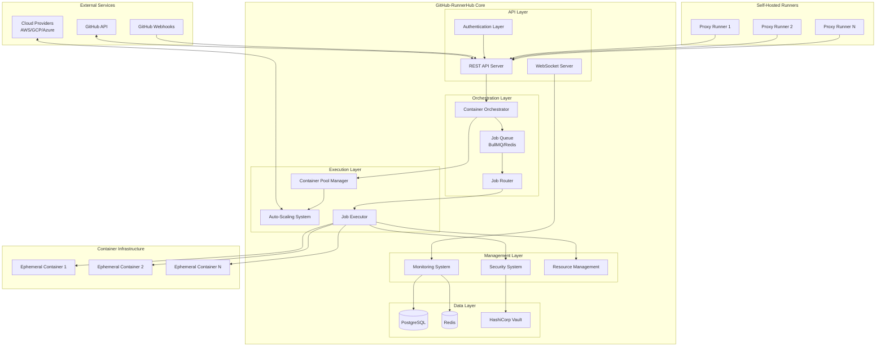

## 🎯 Core Components

### 1. API Layer

#### REST API Server
- **Purpose**: Primary interface for all external interactions
- **Technology**: Express.js with TypeScript
- **Key Features**:
  - RESTful endpoints for all operations
  - JWT-based authentication
  - Rate limiting and request validation
  - Comprehensive error handling
  - API versioning support

#### WebSocket Server
- **Purpose**: Real-time updates and live monitoring
- **Technology**: Socket.IO
- **Key Features**:
  - Live dashboard updates
  - Real-time job status notifications
  - System health monitoring
  - Event streaming for external consumers

#### Authentication Layer
- **Purpose**: Security and access control
- **Technology**: JWT with bcrypt
- **Key Features**:
  - Role-based access control (RBAC)
  - Token-based authentication
  - Session management
  - Rate limiting and account lockout

### 2. Orchestration Layer

#### Container Orchestrator
- **Purpose**: Central coordination of container lifecycle
- **Technology**: Docker API integration
- **Key Features**:
  - Container creation and destruction
  - Lifecycle management
  - Health monitoring
  - Resource allocation
  - Performance optimization

#### Job Queue (BullMQ/Redis)
- **Purpose**: Asynchronous job processing and queuing
- **Technology**: BullMQ with Redis backend
- **Key Features**:
  - Priority-based job queuing
  - Retry logic with exponential backoff
  - Job status tracking
  - Dead letter queue handling
  - Horizontal scaling support

#### Job Router
- **Purpose**: Intelligent job routing and runner selection
- **Technology**: Custom routing engine
- **Key Features**:
  - Label-based job matching
  - Repository-specific routing
  - Capability-based selection
  - Fallback routing strategies
  - Performance-optimized matching

### 3. Execution Layer

#### Container Pool Manager
- **Purpose**: Efficient container pool management
- **Technology**: Custom pool management with ML optimization
- **Key Features**:
  - Pre-warmed container pools
  - Dynamic pool sizing
  - Template-based container creation
  - Health monitoring and replacement
  - Resource optimization

#### Auto-Scaling System
- **Purpose**: Intelligent demand-based scaling
- **Technology**: ML-based prediction with cloud integration
- **Key Features**:
  - Demand prediction algorithms
  - Horizontal scaling logic
  - Cost optimization
  - Performance analytics
  - Multi-cloud support

#### Job Executor
- **Purpose**: Secure job execution in isolated containers
- **Technology**: Docker containers with security hardening
- **Key Features**:
  - Isolated execution environments
  - Security scanning and validation
  - Resource limit enforcement
  - Log collection and analysis
  - Cleanup and recovery procedures

### 4. Management Layer

#### Monitoring System
- **Purpose**: Comprehensive system observability
- **Technology**: Prometheus metrics with custom analytics
- **Key Features**:
  - Real-time metrics collection
  - Performance analytics
  - Anomaly detection
  - Dashboard generation
  - Alert management

#### Security System
- **Purpose**: Enterprise-grade security controls
- **Technology**: Multi-layered security architecture
- **Key Features**:
  - Container vulnerability scanning
  - Secret management
  - Network isolation
  - Audit logging
  - Compliance frameworks

#### Resource Management
- **Purpose**: Comprehensive resource control and optimization
- **Technology**: AI-driven resource optimization
- **Key Features**:
  - CPU and memory limits
  - Storage quota management
  - Network bandwidth controls
  - Usage analytics and reporting
  - Cost optimization

### 5. Data Layer

#### PostgreSQL
- **Purpose**: Primary persistent data storage
- **Technology**: PostgreSQL 16 with extensions
- **Key Features**:
  - ACID transactions
  - JSON/JSONB support
  - Full-text search
  - Partitioning and indexing
  - Backup and recovery

#### Redis
- **Purpose**: Caching and session storage
- **Technology**: Redis with persistence
- **Key Features**:
  - High-performance caching
  - Session management
  - Rate limiting storage
  - Pub/sub messaging
  - Data persistence

#### HashiCorp Vault
- **Purpose**: Secrets management and encryption
- **Technology**: HashiCorp Vault
- **Key Features**:
  - Secret storage and rotation
  - Dynamic credentials
  - Encryption as a service
  - Audit logging
  - Fine-grained access policies

## 🔄 Data Flow Architecture

### 1. Job Submission Flow

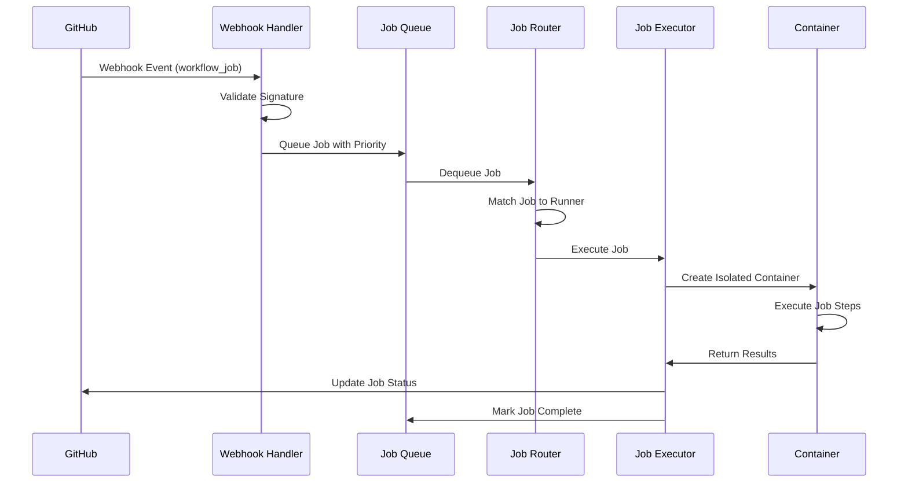

### 2. Scaling Decision Flow

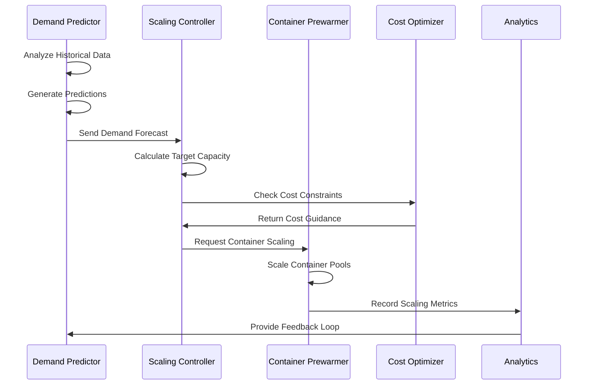

### 3. Security Validation Flow

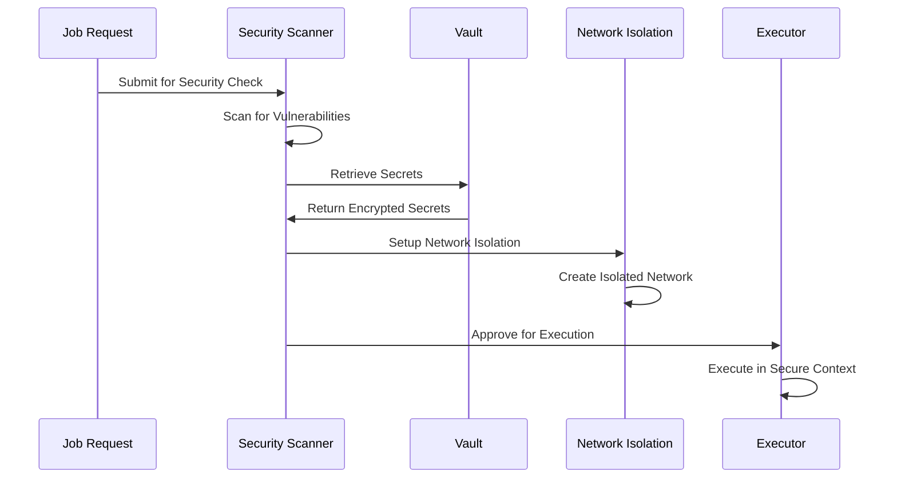

## 🔧 Integration Architecture

### GitHub API Integration

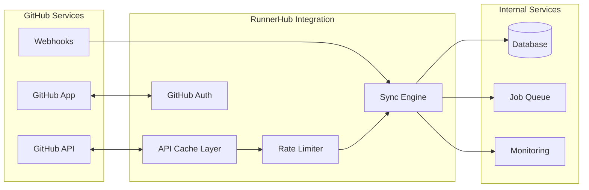

### Cloud Provider Integration

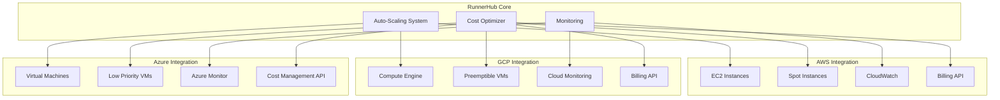

## 🛡️ Security Architecture

### Defense in Depth

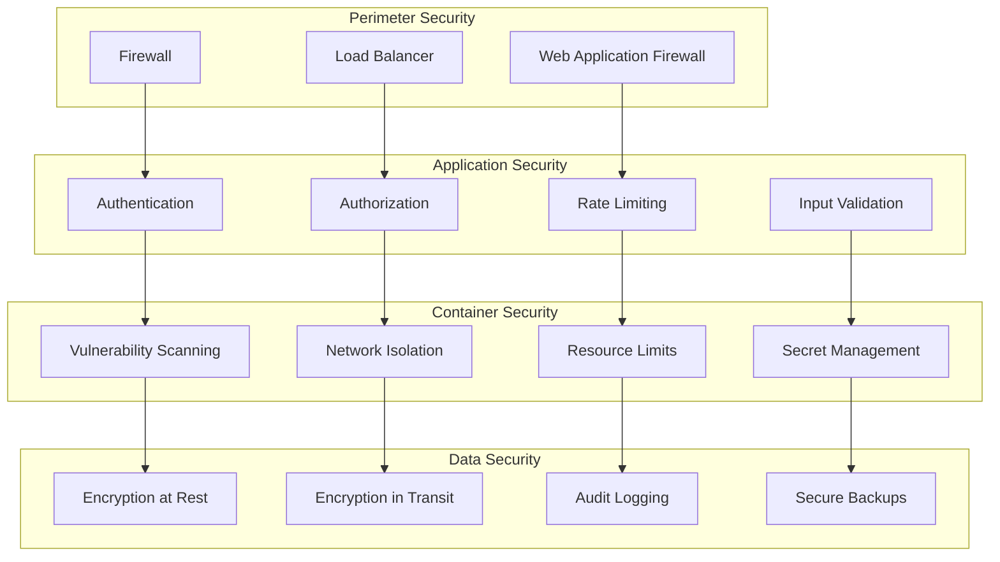

### Container Isolation

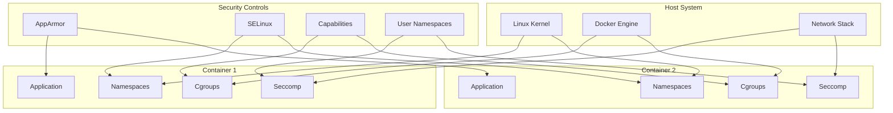

## 📊 Performance Architecture

### Scaling Strategies

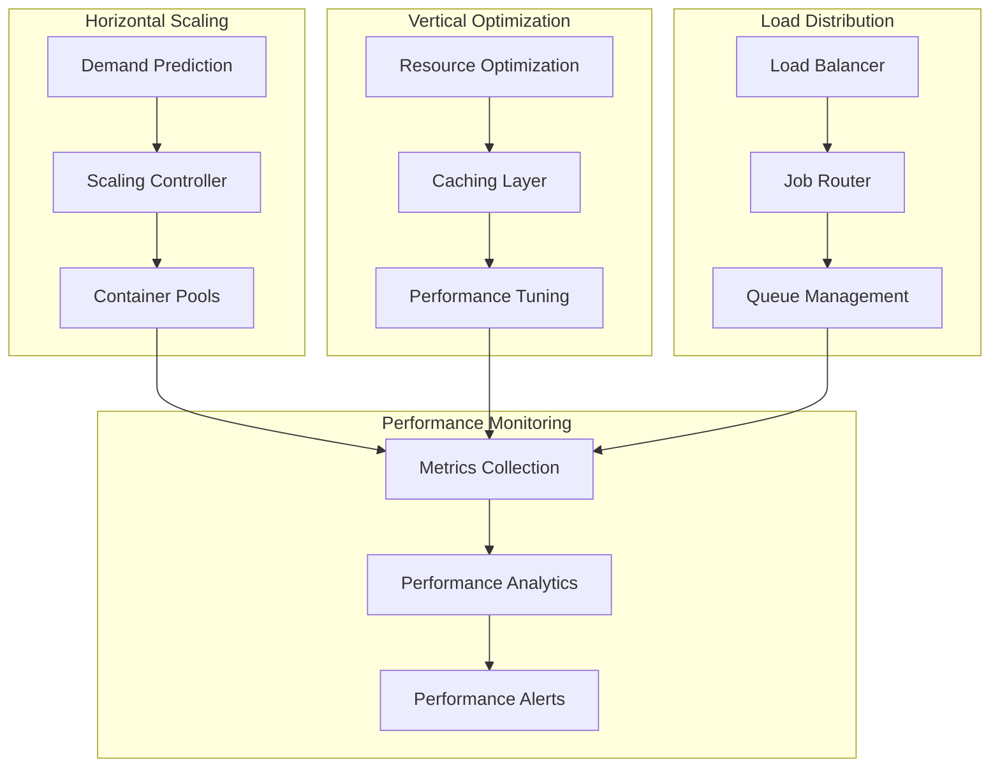

### Caching Architecture

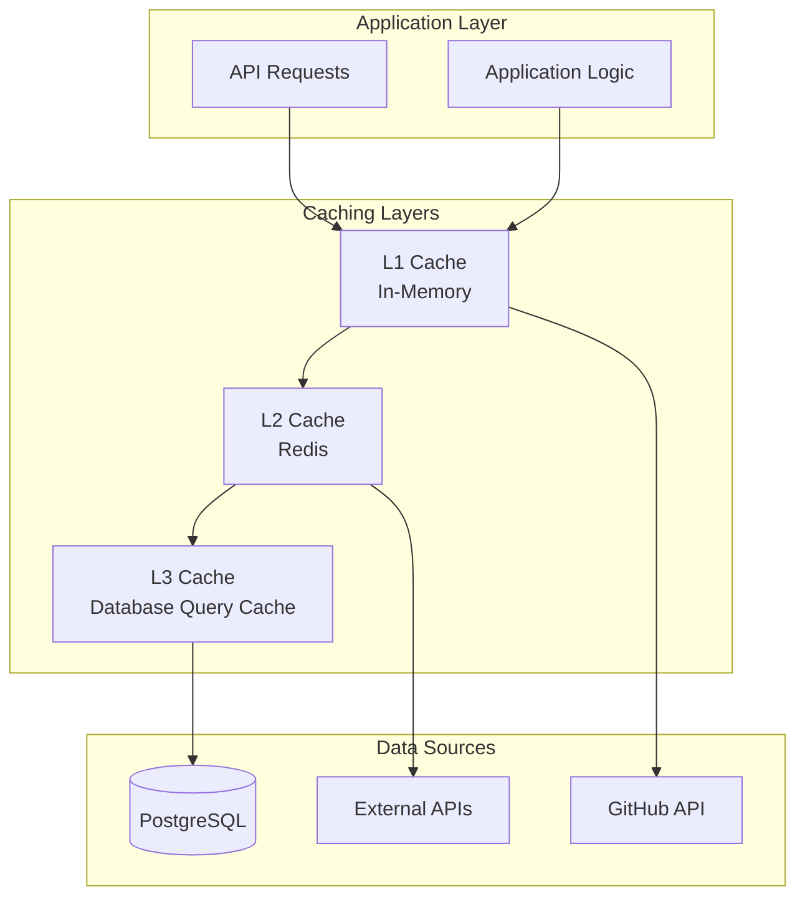

## 🎯 Design Principles

### 1. Scalability
- **Horizontal Scaling**: Components designed for horizontal scaling
- **Stateless Design**: Stateless services for easy scaling
- **Queue-Based Processing**: Asynchronous processing for better throughput
- **Resource Efficiency**: Optimal resource utilization

### 2. Reliability
- **Fault Tolerance**: Graceful handling of component failures
- **Recovery Mechanisms**: Automatic recovery from failures
- **Health Monitoring**: Continuous health checking
- **Data Persistence**: Reliable data storage and backup

### 3. Security
- **Defense in Depth**: Multiple layers of security controls
- **Least Privilege**: Minimal required permissions
- **Isolation**: Strong container and network isolation
- **Audit Trail**: Comprehensive logging and monitoring

### 4. Performance
- **Efficient Resource Usage**: Optimal CPU, memory, and storage usage
- **Caching Strategy**: Multi-level caching for performance
- **Asynchronous Processing**: Non-blocking operations
- **Performance Monitoring**: Continuous performance optimization

### 5. Maintainability
- **Modular Design**: Loosely coupled, highly cohesive modules
- **Clean Architecture**: Clear separation of concerns
- **Documentation**: Comprehensive documentation
- **Testing**: Extensive testing coverage

## 📈 Deployment Architecture

### Development Environment

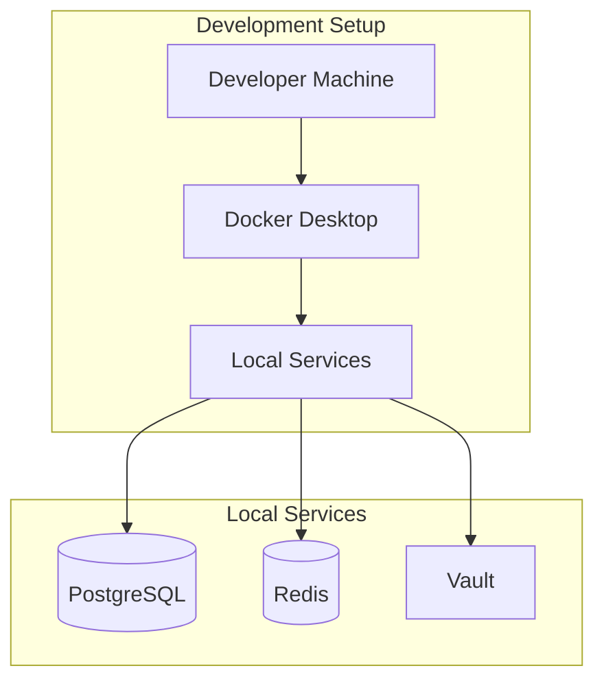

### Production Environment

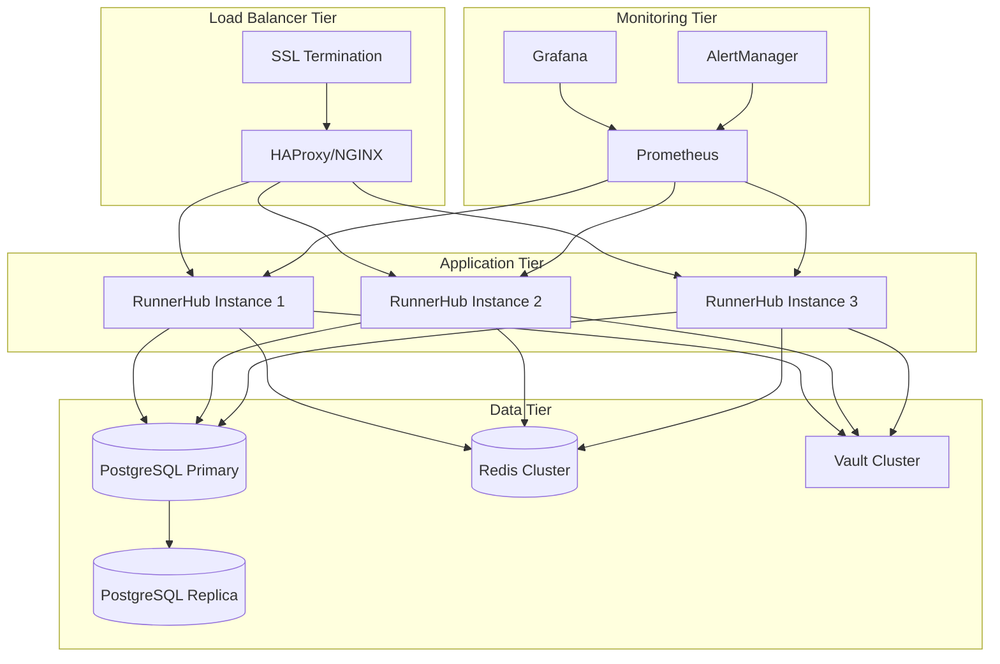

This comprehensive system architecture provides a solid foundation for understanding how GitHub-RunnerHub operates, scales, and maintains security and reliability in production environments.