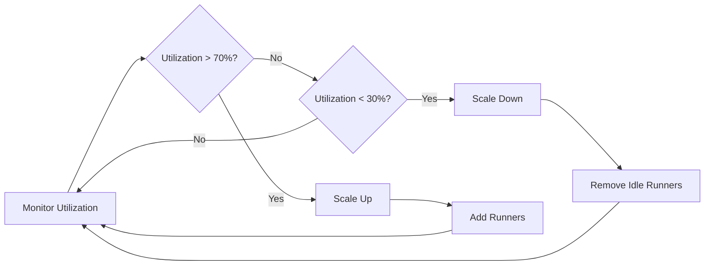

# Auto-Scaling Setup

RunnerHub's auto-scaling feature automatically adjusts the number of runners based on workload, ensuring optimal resource utilization and cost efficiency.

## How Auto-Scaling Works



## Configuration

### Basic Settings

Edit `.env` file:
```env
# Scaling boundaries
MIN_RUNNERS=5                  # Never go below this
MAX_RUNNERS=25                 # Never exceed this

# Scaling triggers
SCALE_UP_THRESHOLD=70          # Scale up when >70% busy
SCALE_DOWN_THRESHOLD=30        # Scale down when <30% busy

# Timing
CHECK_INTERVAL=30              # Check every 30 seconds
IDLE_TIMEOUT=300               # Remove after 5 min idle
```

### Advanced Configuration

Create `config/autoscaler.json`:
```json
{
  "scaling": {
    "minRunners": 5,
    "maxRunners": 25,
    "scaleUpThreshold": 70,
    "scaleDownThreshold": 30,
    "scaleIncrement": 3,
    "scaleDecrement": 1,
    "cooldownPeriod": 60
  },
  "monitoring": {
    "checkInterval": 30,
    "idleTimeout": 300,
    "metricsWindow": 120
  },
  "repositories": [
    "ProjectHub-Mcp",
    "JarvisAI",
    "GitHub-RunnerHub"
  ]
}
```

## Scaling Strategies

### Conservative Scaling
Best for predictable workloads:
```json
{
  "scaleUpThreshold": 80,
  "scaleDownThreshold": 20,
  "scaleIncrement": 1,
  "cooldownPeriod": 300
}
```

### Aggressive Scaling
For bursty workloads:
```json
{
  "scaleUpThreshold": 60,
  "scaleDownThreshold": 40,
  "scaleIncrement": 5,
  "cooldownPeriod": 30
}
```

### Time-Based Scaling
Scale based on time of day:
```json
{
  "timeBasedRules": [
    {
      "schedule": "0 9 * * 1-5",
      "minRunners": 10,
      "comment": "Business hours"
    },
    {
      "schedule": "0 18 * * 1-5",
      "minRunners": 3,
      "comment": "After hours"
    }
  ]
}
```

## Monitoring Auto-Scaling

### Dashboard Metrics
The dashboard shows:
- Current runner count
- Utilization percentage
- Scaling events history
- Queue depth

### Logs
Monitor scaling decisions:
```bash
# View auto-scaler logs
docker logs runnerhub-backend -f | grep SCALE

# Check scaling history
tail -f logs/autoscaler.log
```

### Metrics API
```bash
# Get current metrics
curl http://localhost:8300/api/metrics

# Get scaling history
curl http://localhost:8300/api/scaling/history
```

## Tuning for Your Workload

### Analyze Your Patterns

1. **Check peak times**:
```bash
curl http://localhost:8300/api/metrics/hourly
```

2. **Review job duration**:
```bash
curl http://localhost:8300/api/jobs/stats
```

3. **Monitor queue depth**:
```bash
curl http://localhost:8300/api/workflows/queued
```

### Optimization Tips

1. **For Long-Running Jobs**:
   - Increase `idleTimeout` to avoid premature removal
   - Lower `scaleDownThreshold` to maintain capacity

2. **For Many Short Jobs**:
   - Decrease `checkInterval` for faster response
   - Increase `scaleIncrement` for rapid scaling

3. **For Cost Optimization**:
   - Set aggressive `scaleDownThreshold`
   - Use time-based rules for predictable patterns

## Troubleshooting

### Runners Not Scaling Up
```bash
# Check utilization calculation
curl http://localhost:8300/api/debug/utilization

# Verify thresholds
cat config/autoscaler.json | jq .scaling

# Check for errors
docker logs runnerhub-backend --tail 100 | grep ERROR
```

### Excessive Scaling
```bash
# Increase cooldown period
docker exec runnerhub-backend npm run config:set cooldownPeriod 300

# Adjust thresholds
docker exec runnerhub-backend npm run config:set scaleUpThreshold 80
```

### Performance Impact
```bash
# Monitor resource usage
docker stats runnerhub-backend

# Check scaling frequency
grep "SCALE" logs/autoscaler.log | tail -20
```

## Best Practices

1. **Start Conservative**: Begin with higher thresholds and adjust based on metrics
2. **Monitor Regularly**: Review scaling patterns weekly
3. **Set Alerts**: Configure notifications for scaling events
4. **Test Changes**: Use staging environment for configuration changes
5. **Document Settings**: Keep notes on why specific values were chosen

## Advanced Features

### Custom Scaling Logic

Create `plugins/custom-scaler.js`:
```javascript
module.exports = {
  shouldScaleUp: (metrics) => {
    // Custom logic
    return metrics.queueDepth > 5 || metrics.utilization > 0.7;
  },
  
  shouldScaleDown: (metrics) => {
    // Custom logic
    return metrics.idleRunners > 3 && metrics.utilization < 0.3;
  }
};
```

### Webhook Integration
```bash
# Configure scaling webhooks
curl -X POST http://localhost:8300/api/webhooks \
  -H "Content-Type: application/json" \
  -d '{
    "event": "scale",
    "url": "https://your-webhook.com/scaling",
    "secret": "your-secret"
  }'
```

---

Need help? See [Troubleshooting](Troubleshooting) or [contact support](https://github.com/anubissbe/GitHub-RunnerHub/discussions).