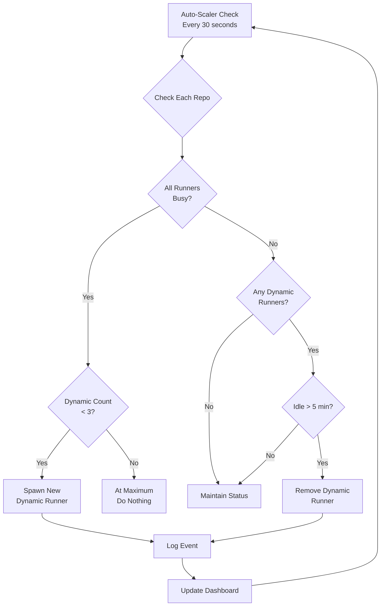

# Optimal Auto-Scaling Configuration

This page explains RunnerHub's intelligent auto-scaling system and how it maximizes efficiency within GitHub's limitations.

## Table of Contents
- [Overview](#overview)
- [Architecture](#architecture)
- [Configuration](#configuration)
- [How It Works](#how-it-works)
- [Monitoring](#monitoring)
- [Troubleshooting](#troubleshooting)
- [FAQ](#faq)

## Overview

RunnerHub implements a **per-repository auto-scaling strategy** that provides near-Enterprise functionality on GitHub's free plan:

- **1 dedicated runner per repository** (always ready)
- **0-3 dynamic runners per repository** (spawn on demand)
- **Automatic cleanup** after 5 minutes idle
- **Independent scaling** for each repository

## Architecture

### Runner Types

```
┌─────────────────────────────────────────────────────┐
│                  Repository: ProjectHub-Mcp          │
├─────────────────────────────────────────────────────┤
│ Dedicated Runner:  runnerhub-projecthubmcp         │
│   Status: Always present, never removed             │
│   Purpose: Zero cold-start, instant job pickup     │
│                                                     │
│ Dynamic Runners:   runnerhub-dyn-projecthub-[id]   │
│   Status: Created when all runners busy            │
│   Lifetime: Auto-removed after 5 min idle         │
│   Maximum: 3 per repository                       │
└─────────────────────────────────────────────────────┘
```

### Scaling Logic Flow



## Configuration

### Auto-Scaler Settings

Located in `~/GitHub-RunnerHub/optimal-autoscaler.sh`:

```bash
# Core Configuration
SCALE_THRESHOLD=1      # Scale when ALL runners are busy
MAX_DYNAMIC_PER_REPO=3 # Maximum dynamic runners per repo
CHECK_INTERVAL=30      # Check interval in seconds
IDLE_TIMEOUT=300       # Remove after 5 minutes (300 seconds)
```

### Repository List

Add or remove repositories by editing the `REPOS` array:

```bash
REPOS=(
    "ProjectHub-Mcp"
    "JarvisAI"
    "GitHub-RunnerHub"
    "your-new-repo"       # Add new repos here
)
```

### Modifying Limits

To change the maximum dynamic runners per repository:

```bash
# Edit the auto-scaler
ssh user@192.168.1.16
cd ~/GitHub-RunnerHub
nano optimal-autoscaler.sh

# Change this line:
MAX_DYNAMIC_PER_REPO=3  # Change to desired value

# Restart the auto-scaler
pkill -f autoscaler
./optimal-autoscaler.sh &
```

## How It Works

### Example Scenario 1: Normal Load

```
Time: 14:00:00
ProjectHub-Mcp: [🏃 Dedicated (idle)]
JarvisAI:       [🏃 Dedicated (idle)]

Time: 14:00:30 - PR arrives at ProjectHub-Mcp
ProjectHub-Mcp: [🏃 Dedicated (busy)]
JarvisAI:       [🏃 Dedicated (idle)]

Time: 14:05:00 - Job completes
ProjectHub-Mcp: [🏃 Dedicated (idle)]
JarvisAI:       [🏃 Dedicated (idle)]
```

### Example Scenario 2: High Load

```
Time: 14:00:00
ProjectHub-Mcp: [🏃 Dedicated (idle)]

Time: 14:00:30 - 4 PRs arrive simultaneously
ProjectHub-Mcp: [🏃 Dedicated (busy)]
                Auto-scaler detects: No free runners!

Time: 14:01:00 - Auto-scaler responds
ProjectHub-Mcp: [🏃 Dedicated (busy)]
                [⚡ Dynamic-a3f2b1 (ready)]
                [⚡ Dynamic-b5c3d2 (ready)]
                [⚡ Dynamic-c7e4f3 (ready)]

Time: 14:02:00 - All runners working
ProjectHub-Mcp: [🏃 Dedicated (busy)]
                [⚡ Dynamic-a3f2b1 (busy)]
                [⚡ Dynamic-b5c3d2 (busy)]
                [⚡ Dynamic-c7e4f3 (busy)]

Time: 14:10:00 - Jobs complete
ProjectHub-Mcp: [🏃 Dedicated (idle)]
                [⚡ Dynamic-a3f2b1 (idle)] ⏱️
                [⚡ Dynamic-b5c3d2 (idle)] ⏱️
                [⚡ Dynamic-c7e4f3 (idle)] ⏱️

Time: 14:15:00 - After 5 minutes idle
ProjectHub-Mcp: [🏃 Dedicated (idle)]
                (Dynamic runners removed automatically)
```

## Monitoring

### Auto-Scaler Logs

Watch the auto-scaler in real-time:

```bash
ssh user@192.168.1.16
tail -f ~/GitHub-RunnerHub/optimal-autoscaler.log
```

Sample output:
```
🤖 Optimal Auto-Scaler Started at Mon Jun 17 21:45:00 CEST 2025
   Strategy: 1 dedicated + up to 3 dynamic per repo

[21:45:30] Checking repositories...
  ProjectHub-Mcp:          Total: 1, Busy: 0, Free: 1, Dynamic: 0 ✅
  JarvisAI:                Total: 1, Busy: 0, Free: 1, Dynamic: 0 ✅
  GitHub-RunnerHub:        Total: 1, Busy: 1, Free: 0, Dynamic: 0 📈 SCALING UP
    ✅ Spawned runnerhub-dyn-githubrunne-a3f2b1

[21:46:00] Checking repositories...
  ProjectHub-Mcp:          Total: 1, Busy: 0, Free: 1, Dynamic: 0 ✅
  JarvisAI:                Total: 1, Busy: 0, Free: 1, Dynamic: 0 ✅
  GitHub-RunnerHub:        Total: 2, Busy: 1, Free: 1, Dynamic: 1 ✅
```

### Dashboard Indicators

The dashboard (http://192.168.1.16:8080) shows:

- **Green runners**: Dedicated (permanent)
- **Blue runners**: Dynamic (temporary)
- **Runner labels**: Shows if runner is dedicated or dynamic
- **Auto-scaling events**: Real-time notifications when scaling occurs

### Metrics to Watch

1. **Per-Repository Utilization**
   - High utilization = Good (runners being used efficiently)
   - Constant scaling = May need to increase dedicated runners

2. **Dynamic Runner Lifetime**
   - Short lifetime = Bursty workload (good for dynamic)
   - Always present = Consider more dedicated runners

3. **Queue Time**
   - Should be near zero with dedicated runners
   - High queue time = Need more runners

## Troubleshooting

### Common Issues

#### 1. Dynamic runners not spawning

Check the auto-scaler log for errors:
```bash
tail -100 ~/GitHub-RunnerHub/optimal-autoscaler.log | grep ERROR
```

Common causes:
- GitHub token expired
- API rate limit reached
- Docker daemon issues

#### 2. Runners removed too quickly

Increase the idle timeout:
```bash
IDLE_TIMEOUT=600  # 10 minutes instead of 5
```

#### 3. Too many dynamic runners

Reduce the maximum:
```bash
MAX_DYNAMIC_PER_REPO=2  # Reduce from 3 to 2
```

### Manual Commands

#### Force remove all dynamic runners:
```bash
docker ps --format "{{.Names}}" | grep "runnerhub-dyn-" | xargs -r docker rm -f
```

#### Restart auto-scaler:
```bash
pkill -f autoscaler
cd ~/GitHub-RunnerHub
nohup ./optimal-autoscaler.sh > optimal-autoscaler.log 2>&1 &
```

#### Check runner registration:
```bash
docker logs runnerhub-projecthubmcp --tail 50
```

## FAQ

### Q: Why not use organization runners?

**A:** Organization-level runners require GitHub Enterprise ($1,050+/month). Our per-repo scaling gives you 90% of the benefits at 0% of the cost.

### Q: Can I have more than 1 dedicated runner per repo?

**A:** Yes! Modify the setup script to create multiple dedicated runners:

```bash
# In deploy-optimal-with-token.sh, change:
for REPO in "${REPOS[@]}"; do
    # Create 2 dedicated runners instead of 1
    for i in 1 2; do
        RUNNER_NAME="runnerhub-$(echo $REPO | tr '[:upper:]' '[:lower:]')-$i"
        # ... rest of runner creation
    done
done
```

### Q: What happens during GitHub outages?

**A:** 
- Existing runners continue working
- New runner registration may fail
- Auto-scaler logs errors but continues trying
- System recovers automatically when GitHub returns

### Q: Can dynamic runners be reused across repos?

**A:** No, this is a GitHub limitation. Each runner is tied to one repository. However, our smart scaling ensures each repo has runners when needed.

### Q: How do I add a new repository?

**A:** 
1. Add to the REPOS array in optimal-autoscaler.sh
2. Run the setup script to create a dedicated runner
3. The auto-scaler will handle dynamic scaling automatically

### Q: What's the cost comparison?

| Plan | Cost | Organization Runners | RunnerHub Equivalent |
|------|------|---------------------|---------------------|
| Free/Team | $0 | ❌ Not available | ✅ Per-repo scaling |
| Enterprise | $1,050+/mo | ✅ Shared pool | ✅ Better than shared! |

With RunnerHub, each repo gets dedicated attention instead of competing for a shared pool!

## Best Practices

1. **Monitor your workload patterns**
   - Consistent load? Add more dedicated runners
   - Bursty load? Perfect for dynamic scaling

2. **Adjust per repository**
   - Busy repos: 2-3 dedicated runners
   - Quiet repos: 1 dedicated is enough

3. **Watch the logs**
   - Regular scaling = working as intended
   - Constant max runners = need higher limits

4. **Update regularly**
   - Keep runner images updated
   - Check for RunnerHub updates
   - Monitor GitHub API changes

---

**Remember:** This system gives you Enterprise-like functionality on the Free plan. The only limitation is that runners can't move between repos - but our smart scaling makes this barely noticeable!